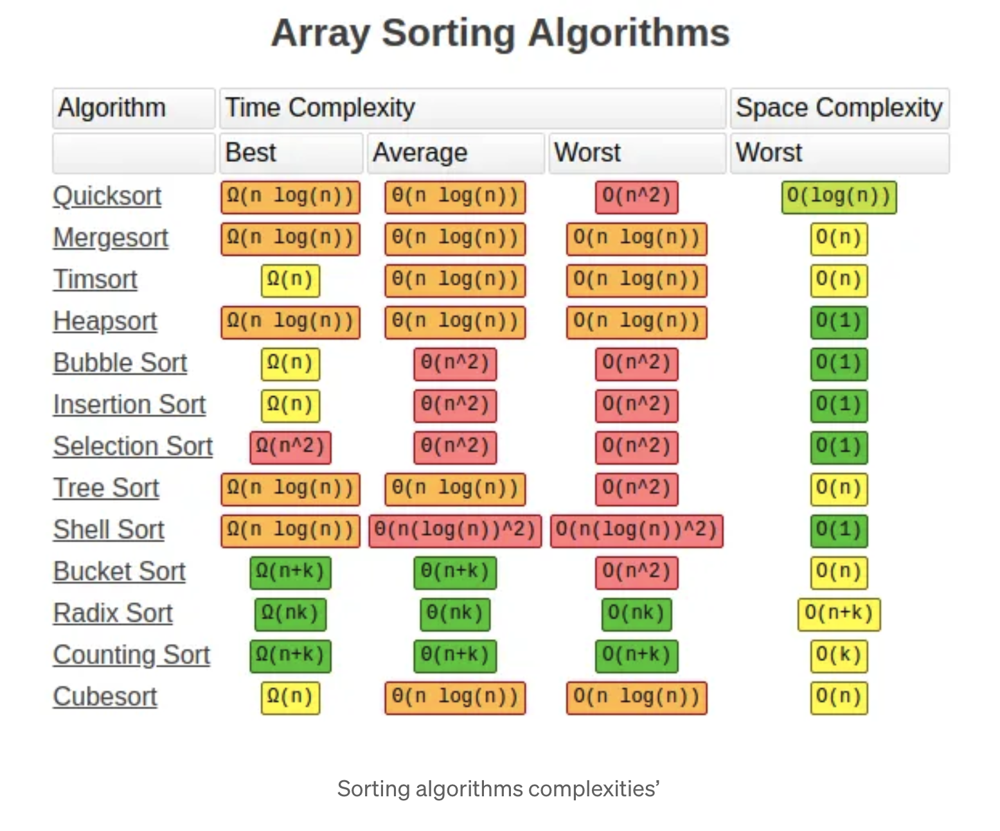

# sortingalgos
sorting algorithms in python

## 1

Some simple sorting algorithms implemented in python. Looked up from different sources and re-implemented here.
These are for learning and teaching purposes. Use algos from packages for robus algos.

Links:
https://medium.com/@george.seif94/a-tour-of-the-top-5-sorting-algorithms-with-python-code-43ea9aa02889

- **Bubble Sort**: Iteratively compares adjacent elements and swaps them if they are out of order. The largest element “bubbles” to the end of the list with each pass.
- **Selection Sort**: Finds the minimum element in the unsorted portion of the list and swaps it with the first element. Repeats this process until the entire list is sorted.
- **Insertion Sort**: Builds the sorted list one element at a time by inserting each unsorted element into its correct position in the sorted portion.
- **Quick Sort / Partition Sort**: A divide-and-conquer algorithm that selects a pivot element, partitions the list into two sublists based on the pivot, and recursively applies the same process to the sublists.
- **Merge Sort**: Another divide-and-conquer algorithm that recursively divides the list into smaller sublists, sorts them, and then merges them back together to obtain the sorted list.

## 2

- https://www.geeksforgeeks.org/learn-data-structures-and-algorithms-dsa-tutorial
- https://builtin.com/machine-learning/fastest-sorting-algorithm
- https://egghead.io/courses/data-structures-and-algorithms-in-javascript
- https://www.ladybug.dev/episodes/data-structures-and-algorithms

## ToDo

k-smallest